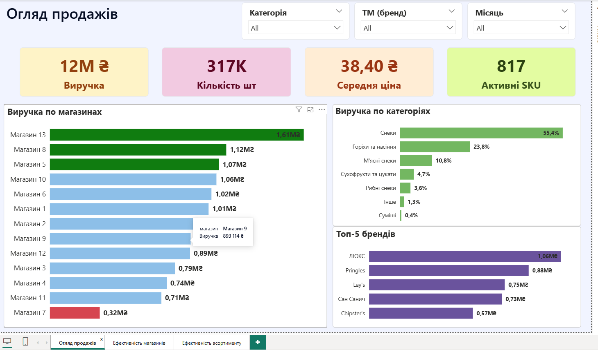
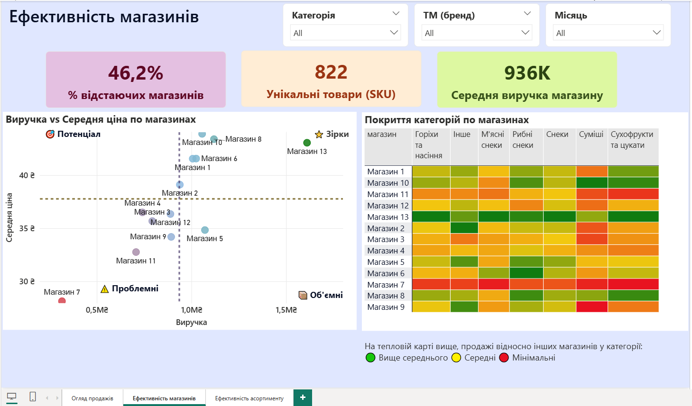
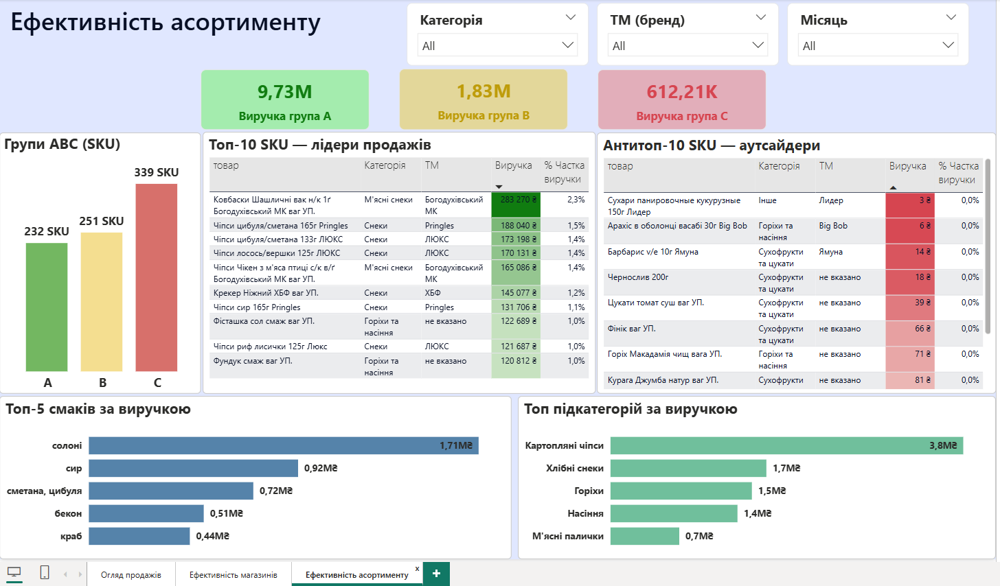

# Retail Snacks — Sales Analytics

[🇺🇦 Українська](README.md) &nbsp;|&nbsp; 🇬🇧 English

Sales analysis for a retail snack chain across 13 stores.  
Full cycle: raw data → structuring → data model → dashboards → insights.

---

## Dashboards

### Sales Overview


### Store Performance


### Assortment Efficiency


---

## About the Project

The source data consisted of three Excel files in different formats covering one month of sales across 13 stores — roughly 8,500 rows of transactions. The data arrived raw: no categories, no brands, no flavors — just product names, quantities, and revenue figures.

The goal was to clean and structure the data, build a product reference directory, and deliver analytics in Power BI.

**What was done:**
- wrote 4 Python scripts for data cleaning, categorization, and validation
- categorized 822 unique SKUs across 6 categories and 22 subcategories
- extracted weight, flavor, and brand from product names using regex
- validated the reference directory via Claude API in batches of 25 products
- manually reviewed and corrected fields where automation fell short
- built a data model and three interactive dashboards in Power BI

---

## Insights

**Store 13 — clear leader.** Revenue of 1.61M, green across most categories on the heat map, the only store firmly in the Stars zone on the scatter plot. Worth understanding what drives results there and replicating it across the network.

**Store 5 — anomaly.** Weak category coverage on the heat map, mostly mid and low scores. Yet revenue hits 1.07M and the store lands in the Stars zone. The result appears to be driven by a narrow set of SKUs while the rest of the assortment underperforms. Worth checking whether the store simply carries fewer products or whether existing products just aren't selling.

**Meat snacks — hidden potential.** The top SKU by revenue generates 203K UAH in a single month. Yet the entire Meat Snacks category accounts for only 10.8% of total revenue. If one product pulls that kind of number, the category has room to grow significantly. Expanding the assortment here looks like a clear opportunity.

**Group C, 339 SKUs.** These 339 positions together generate 612K UAH — under 5% of total revenue — while occupying shelf space and order capacity. Not necessarily worth cutting all of them, but each one needs a closer look: whether it serves a complementary demand or simply sits without movement.

**Unbranded products in the top 10.** Two nut SKUs with no listed manufacturer both appear in the top 10 by revenue. Either a private label or a supplier that was never entered into the system. Worth clarifying.

**Category concentration.** Snacks account for 55.4% of revenue. Gradually growing the share of Meat Snacks and Nuts would reduce dependence on a single category.

---

## Stack

| Tool | Used for |
|---|---|
| Python | Data cleaning, categorization, reference directory |
| pandas, openpyxl, xlrd | Reading and transforming Excel files |
| regex | Extracting weight and flavor from product names |
| Claude API | Validating 822 products in batches |
| Power BI | Data model, DAX measures, dashboards |

---

## Project Structure

```
05_retail-snacks-analytics/
├── data/
│   ├── raw/                      # Source files (~8500 rows)
│   │   ├── 1.xlsx
│   │   ├── 2.xls
│   │   └── 3.xlsx
│   ├── processed/                # Categorization output
│   └── reference/                # Product reference directory
│       ├── directory_master.xlsx
│       └── directory_master_final.xlsx
├── scripts/
│   ├── 01_categorize_products.py
│   ├── 02_update_master.py
│   ├── 03_extract_brands.py
│   └── 04_validate_with_api.py
├── screenshots/
│   ├── dashboard_1_overview.png
│   ├── dashboard_2_stores.png
│   └── dashboard_3_assortment.png
├── Power BI/
│   └── Analyse.pbix
├── README.md
└── README_EN.md
```

---

## Pipeline

```
3 Excel files in different formats (~8500 rows)
        |
        v
01_categorize_products.py
    - merges tables from all source files
    - categorization: 6 categories, 22 subcategories
    - regex: extracts weight and flavor from product name
    - brand library: identifies trademark
        |
        v
02_update_master.py
    - creates reference directory if it doesn't exist
    - fills only empty cells, preserves manual edits
        |
        v
03_extract_brands.py
    - extracts brand candidates from the end of product names
    - outputs top-100 by frequency for manual review
        |
        v
04_validate_with_api.py
    - sends 822 products in batches of 25 via Claude API
    - checks category, subcategory, brand, flavor logic
    - output: report with OK / Error columns and explanations
        |
        v
Manual review of directory_master_final.xlsx
        |
        v
Power BI: import, many-to-one relationship on "product" column, dashboards
```

---

## Running the Scripts

```bash
pip install pandas openpyxl xlrd anthropic
```

```bash
python scripts/01_categorize_products.py
python scripts/02_update_master.py
python scripts/03_extract_brands.py

# Validation requires an API key
export ANTHROPIC_API_KEY=your_key_here
python scripts/04_validate_with_api.py
```
